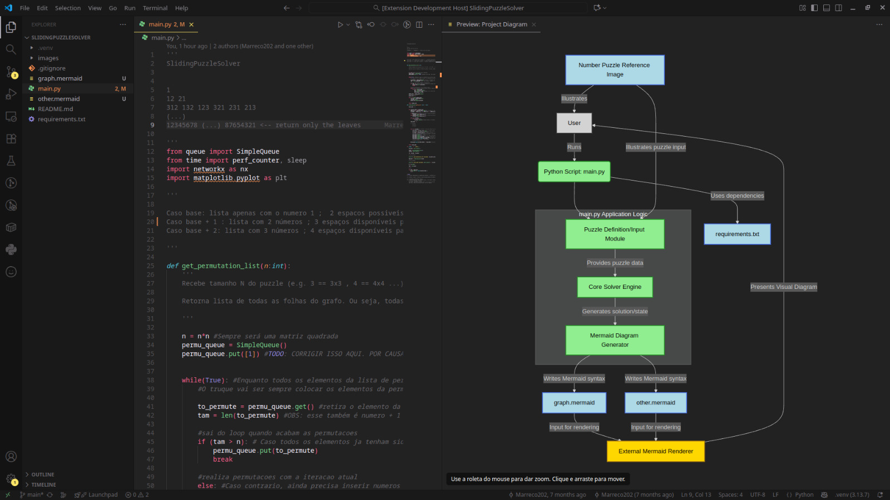

<p align="center">
  
</p>

# CiD - Companion in Development

An open-source VS Code extension that helps newcomers understand and contribute to open-source repositories through AI-generated architectural diagrams.

[](https://marketplace.visualstudio.com/items?itemName=Marreco202.cid-extension)
[](https://opensource.org/licenses/MIT)
[](https://code.visualstudio.com/api)
[](CONTRIBUTE.md)

## Features

CID is an AI assistant extension that helps developers understand, analyze, and visualize their codebase with multiple AI model support.


<p align="center">
  
</p>

### 🤖 Multi-Model AI Support

- **GPT (OpenAI)**: Use OpenAI's GPT models for code analysis
- **Gemini (Google)**: Leverage Google's Gemini Pro models
- **Ollama**: Run local models for privacy-focused development

### 📊 Mermaid Diagram Generation

Automatically generate visual diagrams of your project structure:
- Analyze repository architecture
- Create flowcharts and dependency diagrams
- Render diagrams with interactive pan and zoom

**Commands**: 


For generating new diagram based on current repository:

`CID: Generate and Show Mermaid for Project`

For rendering the mermaid file opened on WebView:

`CID: Render Mermaid File on Webview`

### 🎨 Custom Sidebar View

Access CiD features through a dedicated sidebar panel in the Activity Bar:
- Quick access to the chat interface
- Generate graphs [TODO]
- Easy navigation to all CiD commands [TODO]

## Requirements

### API Keys (Optional, based on model choice)

Depending on which AI model you want to use, you'll need:

- **OpenAI GPT**: OpenAI API key
- **Google Gemini**: Google AI API key
- **Ollama**: Local Ollama installation (no API key needed, just the name of the chosen model)

### Dependencies

The extension automatically includes:
- `openai` - OpenAI SDK
- `@google/genai` - Google Generative AI SDK
- `ollama` - Ollama JavaScript library
- `mermaid` - Diagram rendering
- `dotenv` - Environment variable management

## Installation

1. Install the extension from the VS Code Marketplace (when published)
2. Or run from source:
   ```bash
   npm install
   npm run compile
   ```
3. Configure your preferred AI model in the extension settings

## Usage

### Generating Project Diagrams

1. Open your project in VS Code
2. Run: `CID: Generate and Show Mermaid for Project`
3. View the interactive diagram in a new panel

## Available Commands

| Command | Description |
|---------|-------------|
| `CID: Open Chat` | Launch the interactive AI chat interface |
| `CID: Explain Current File` | Get an AI explanation of the active file |
| `CID: List all functions on project` | Analyze all Python functions in workspace |
| `CID: List Workspace Files` | Display all TypeScript files |
| `CID: Generate and Show Mermaid for Project` | Create and display project diagram |
| `CID: Render Mermaid File on Webview` | Preview an open Mermaid file |
| `CID: Test Gemini Connection` | Verify Gemini API connectivity |
| `CID: Find and Console Log README.md` | Debug utility for README detection |

## Extension Settings

This extension is currently in early development. Configuration settings will be added in future releases for:

- AI model selection
- API endpoints
- Custom prompts
- Output preferences

## Known Issues

- The extension is in active development (v0.0.1)
- Some commands are experimental and may require additional configuration
- Python analysis feature is optimized for Python files only (needs help)
- At the current state, the graph generation won't work due to a bug (explained in [Issue #8](https://github.com/Marreco202/cid-extension/issues/8))

## Architecture

### Services
- `GPTService.ts` - OpenAI GPT integration
- `GeminiService.mts` - Google Gemini integration
- `OllamaService.ts` - Local Ollama model support
- `RepositoryService.ts` - Workspace file analysis

### Providers
- `ChatViewProvider.ts` - Chat interface management
- `MermaidViewProvider.ts` - Diagram rendering
- `ModelProvider.ts` - AI model factory
- `RepoDataProvider.ts` - Repository data collection
- `FunctionsTreeDataProvider.ts` - Sidebar tree view

## Release Notes

### 0.0.1

Initial development release:
- Multi-model AI support (GPT, Gemini, Ollama)
- Interactive chat interface with streaming responses
- Mermaid diagram generation
- Python function analysis
- Custom sidebar integration

## Contributing

We welcome contributions from the community! Please read our [Contributing Guidelines](CONTRIBUTE.md) to understand our workflow, commit convention, and how to submit a Pull Request. Please also review our [Code of Conduct](CODE_OF_CONDUCT.md) before participating.

## License

This project is licensed under the [MIT License](LICENSE).

**Enjoy using CID!**
